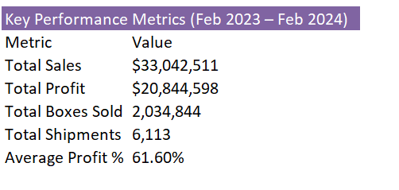
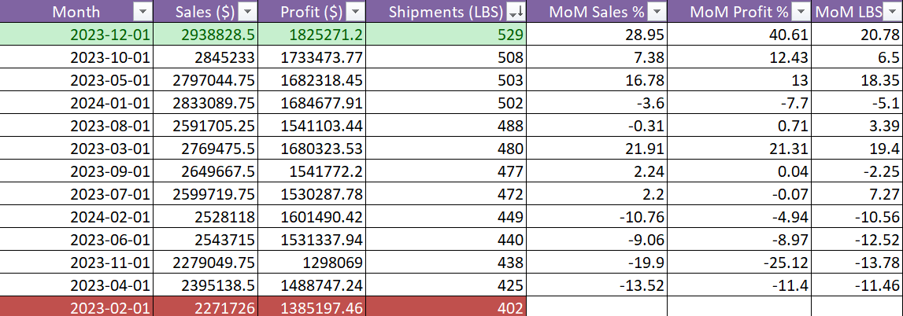
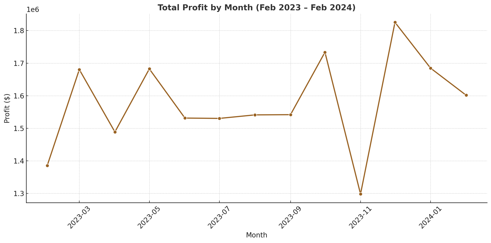
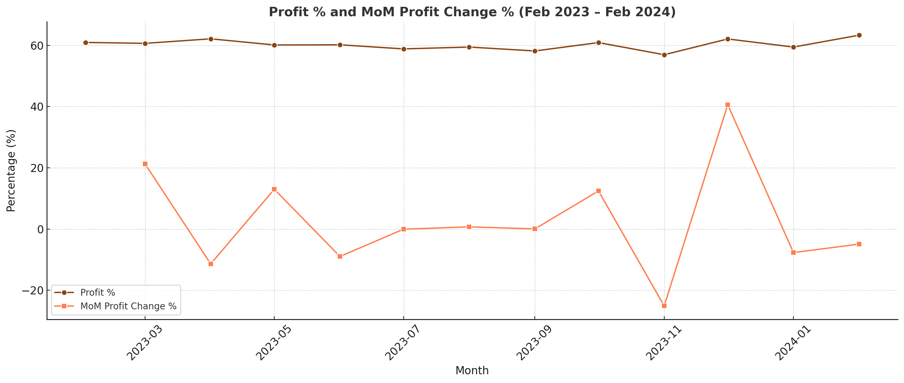
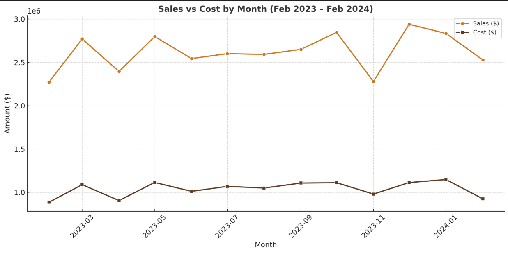
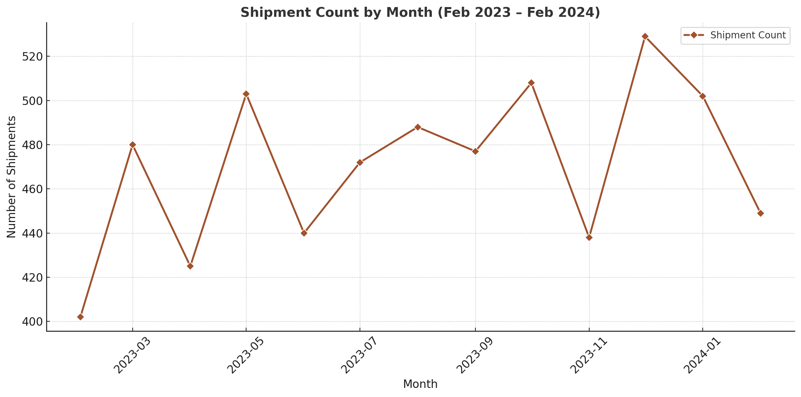
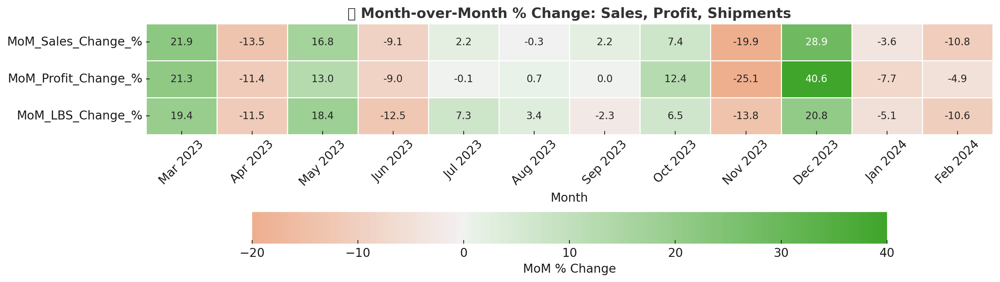
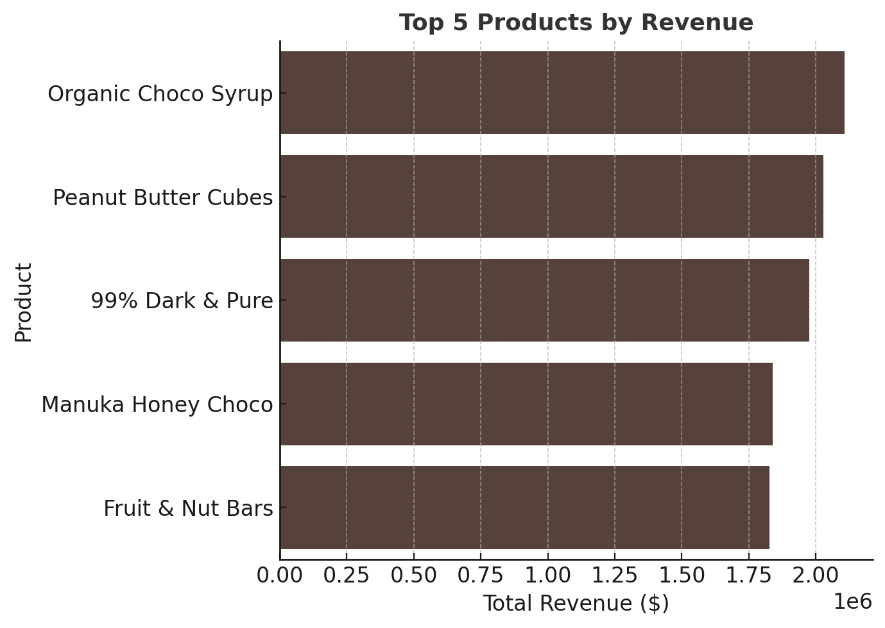
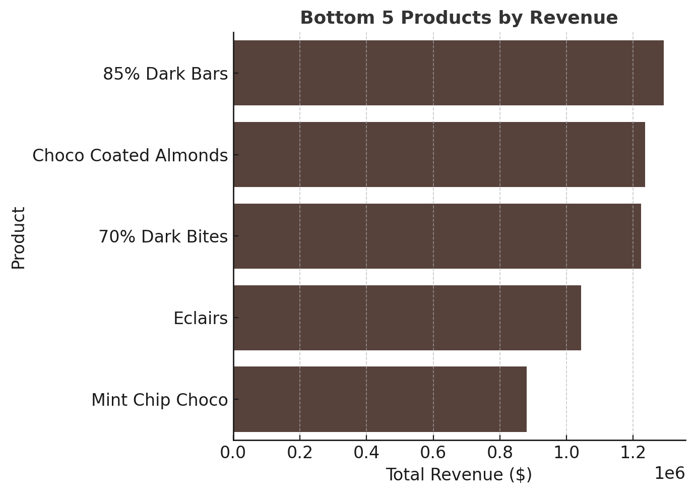
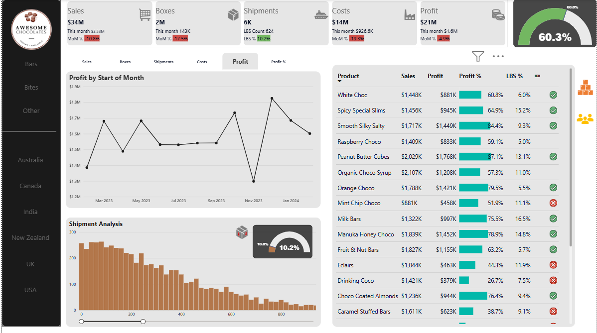

**_Executive Sales Analysis, Product Insights, and Actionable Strategy for Awesome Chocolate Inc_**

## 📚 Table of Contents

1. [📁 Project Background](#1-project-background)  
2. [🧠 Executive Summary](#2-executive-summary)  
   - [📘 Schema ERD Diagram](#schema-erd-diagram)  
3. [🔍 Insight Deep Dive (MoM Matrix)](#3-insight-deep-dive-mom-matrix)  
   - [📊 Best Month Analysis (Dec 2023)](#best-month-analysis-dec-2023)  
   - [📉 Worst Month Analysis (Feb 2023)](#worst-month-analysis-feb-2023)  
4. [📈 Performance Visuals & Trends](#4-performance-visuals--trends)  
   - [📊 Total Profit by Month](#total-profit-by-month)  
   - [📊 Profit % & MoM Profit Change](#profit--mom-profit-change)  
   - [📊 Sales vs Cost by Month](#sales-vs-cost-by-month)  
   - [📊 Shipment Count by Month](#shipment-count-by-month)  
5. [🌡️ MoM % Change Heatmap](#5-mom--change-heatmap)  
6. [💼 Product Performance](#6-product-performance)  
   - [🔝 Top 5 Performing Products](#top-5-performing-products)  
   - [🔻 Bottom 5 Performing Products](#bottom-5-performing-products)  
7. [✅ Strategic Recommendations](#7-overall-recommendations)  
8. [❓ Clarifying Questions & Assumptions](#8-clarifying-questions--assumptions)

---

## 1. Project Background

**Awesome Chocolate** is a gourmet chocolate startup founded in **February 2023**, offering a variety of high-end products like chocolate bars, syrups, cubes, and specialty bites. The company operates across **North America (USA, Canada)**, **Asia-Pacific (India, Australia, New Zealand)**, and **Europe (UK)**. It launched with a **lean product portfolio** and a growing international sales team. In collaboration with the Head of Sales, I developed a report to analyze the company’s first full year of operations and deliver recommendations to improve performance across sales and the  product teams.

The objectives of this analysis are to:
- **Evaluate sales performance** across products, time, and region  
- **Identify top and low-performing products** to guide marketing, production, and distribution  
- **Deliver clear, data-backed recommendations** to improve revenue and operational efficiency

---

## 2. Executive Summary

**Awesome Chocolate** generated over **$33M in sales** in its first 13 months, with **61.6% margins**, across 6,113 global shipments. Performance peaked in **December 2023**, driven by **$2.94M** in sales and **529** shipments, especially from **Canada and the USA**. The lowest-performing month was **February 2023**, with only **402** shipments, a typical result for a startup’s early ramp-up. The top 5 products (Organic Choco Syrup, Peanut Butter Cubes, 99% Dark & Pure, Manuka Honey Choco, Fruit & Nut Bars) contributed over 29% of revenue, while the bottom 5 ( 85% Dark Bars, Choco Coated Almonds, 70% Dark Bites, Eclairs, and Mint Chip Choco primarily in **India and Australia** showed weak traction.

### Schema ERD Diagram

---

## 3. Insight Deep Dive 

### Best Month Analysis (Dec 2023)
- **Sales:** $2.94M  
- **Profit:** $1.83M  
- **Shipments:** 529  
- **Region Drivers:** Canada, USA
  
✅ December recorded the highest profit, sales, and shipment volume of the entire year, with demand peaking in North America.

📌 Action: Prioritize Q4 for seasonal campaigns, allocating up to **20 - 25%** of annual stock and promotional spend, with targeted focus on **Canada and USA**, which historically delivered the highest year-end demand.

### Worst Month Analysis (Feb 2023)
- **Sales:** $2.27M  
- **Profit:** $1.39M  
- **Shipments:** 402  
- **Region:** India lagging  

✅ Insight: February had the lowest performance metrics across all KPIs, especially in APAC markets like India, which is consistent with typical startup ramp-up and post-holiday sales fatigue.

📌 Action: Designate February for internal training, pilot product tests, or operational reviews instead of outbound campaigns to optimize team readiness for Q2 and beyond.

---

## 4. Performance Visuals & Trends

### 4A. Profit, Sales, Shipments Over Time

### Total Profit by Month

✅ Insight: Profit fluctuated between $1.39M and $1.83M, with a noticeable Q4 uplift starting in October, showing strong seasonal demand that should drive procurement planning.

### Profit % & MoM Profit Change

✅ Insight: While profit margins stayed stable (~60%), MoM profit changes revealed volatility, especially the -25.1% drop in November 2023, prompting an investigation into product or fulfillment disruptions. Demands ops review.

### Sales vs Cost by Month

✅ Insight: The gap between Sales and Cost was widest in December 2023 ($2.9M vs $1.1M), reaffirming the importance of holiday campaigns and cost-controlled supply chain strategies.

### Shipment Count by Month

✅ Insight: Shipments grew steadily from 402 to a high of 529, with Canada consistently among the top contributors. This shows the maturity of the sales process and rep performance in the Americas.

---

## 5. MoM % Change Heatmap

**December 2023: Your Growth Lever**
  December showed the highest month-over-month increases across all three KPIs: **+28.9% in Sales**, **+40.6% in Profit**, and **+20.8% in Shipments**. This consistent spike indicates a seasonal demand surge, likely tied to holiday consumption patterns. It’s a strong signal to invest in Q4 campaign planning, inventory build-up, and logistics readiness for end-of-year demand.

---  

**November 2023: Coordinated Dip**
November marked a simultaneous drop across KPIs: **-19.9% in Sales**, **-25.1% in Profit**, and **-13.8% in Shipments**. This suggests potential operational issues such as stockouts, delivery delays, or poor campaign timing. It’s a red flag for both the marketing and supply chain teams to investigate and mitigate risk during future Q4 planning.

---

**February (2023 & 2024): Predictably Soft Starts**
February performance was consistently flat or declining, with **February 2023** having the lowest shipment count (402) and **Profit at just $1.39M**. This reflects common post-holiday slowdowns and the natural lag from startup onboarding. Rather than forcing growth here, it's best used for internal reviews, product pilots, or team training.

---

## 6. Product Performance

### Top 5 Performing Products

✅ Insight: These products generated nearly 30% of total revenue across all months and were strongly represented during peak sales in Q4. Their consistency across regions and time supports their use in seasonal bundling and justifies higher stock allocation.

📌 Action: These products should be included in Q4 holiday gift packs, especially for Canada and the USA, where demand was highest

### Bottom 5 Performing Products

 ✅ Insight: These products contributed less than 2% of total annual revenue and showed weak performance across most months, with limited regional traction, especially in India and Australia. Their persistently low sales volume suggests poor market fit, justifying reduced production, regional pullback, or product reformulation before future relaunch.

📌 Action: Consider A/B testing flavor variants or phasing out these SKUs in low-performing regions. Don’t restock until demand is validated.

----

## 7. Overall Recommendations

**Prioritize Q4 for Revenue Growth**
December 2023 alone contributed ~9% of total revenue, with all KPIs peaking. Allocate 20–25% of the annual inventory and marketing budget toward October–December, especially in Canada and USA.

---

**Bundle Top-Selling Products for Holiday Campaigns**
Products like Organic Choco Syrup, Peanut Butter Cubes, and 99% Dark & Pure accounted for ~30% of revenue. Bundle them in seasonal offers to drive upsell volume and average order value.

---

**Phase Out or Reposition Underperforming Products**
Bottom 5 products contributed <2% of revenue. Products like Mint Chip Choco and Eclairs underperformed consistently, especially in India and Australia — recommend pulling them or running taste reformulation pilots.

---

**Use February Strategically for Operations, Not Sales**
February showed consistently low shipments (402 in 2023). Avoid big launches in Q1 — instead, use it for team training, supplier audits, and product testing.

---

**Investigate November Sales Dip**
Despite being in Q4, November 2023 had a sharp -25% drop in MoM profit. Audit campaign execution, fulfillment delays, or stockout patterns to avoid repeat performance losses.

---

**Invest in Canada and the USA as Core Growth Markets**
These two countries led sales and shipments in peak months. Recommend regional targeting in digital marketing, promotions, and retail partnerships.

---
**Maintain Lean Product Portfolio with Strategic Depth**
Focus inventory and R&D around proven categories (syrups, cubes, dark bars) rather than expanding breadth. Let data-driven sales justify new SKUs.

---

## 8. Clarifying Questions & Assumptions

### Questions
- What caused the November 2023 drop in sales/profit?
- Were there stockouts, logistics delays, or missed campaigns?

### Assumptions
- One shipment = one transaction  
- Cost per box assumed constant  
- No discount or refund data available

---
## 9. Dashboard

